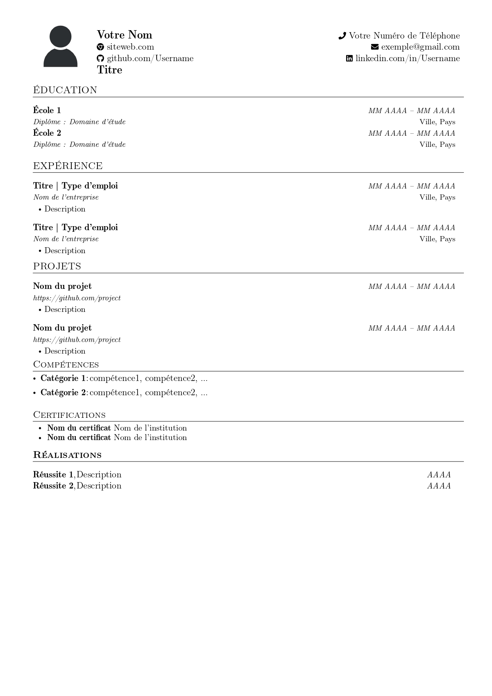

# Modèle de CV en LaTeX

Ce dépôt contient un modèle LaTeX pour créer un CV.

## Utilisation

1. Clonez ou téléchargez ce dépôt sur votre machine locale.
2. Modifiez le fichier [`main.tex`](main.tex) à l'aide d'un éditeur LaTeX.
3. Personnalisez le contenu en fonction de vos informations personnelles, de votre éducation, de votre expérience, etc.
4. Remplacez [`photo.jpg`](photo.jpg) par votre photo de profil et mettez à jour le chemin du fichier dans `main.tex` en conséquence.
5. [Compilez](https://guides.lib.wayne.edu/latex/compile) le fichier `main.tex` pour générer votre CV au format PDF.

## Aperçu du CV

## Remerciements

- Ce modèle LaTeX est basé sur certains modèles existants avec des modifications.

## Contribution

Les contributions sont les bienvenues ! Si vous avez des suggestions, des améliorations ou des corrections de bogues, n'hésitez pas à ouvrir un problème ou à soumettre une demande de fusion.
